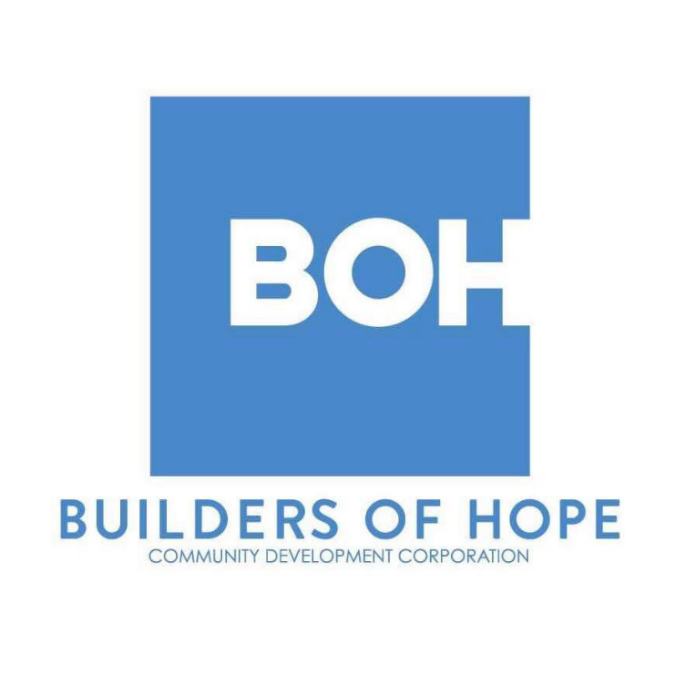

{width=80%}

# **Introduction**

This GitHub website is designed for Builders of Hope. The main purpose of this website is to provide the data dictionary and a summary of the analysis.

# **Tabs**
 
1. West Dallas Analysis: TBD

2. South Dallas Analysis: TBD

3. Vickery Meadow Analysis: TBD

4. Data Dictionary: TBD

</a>

